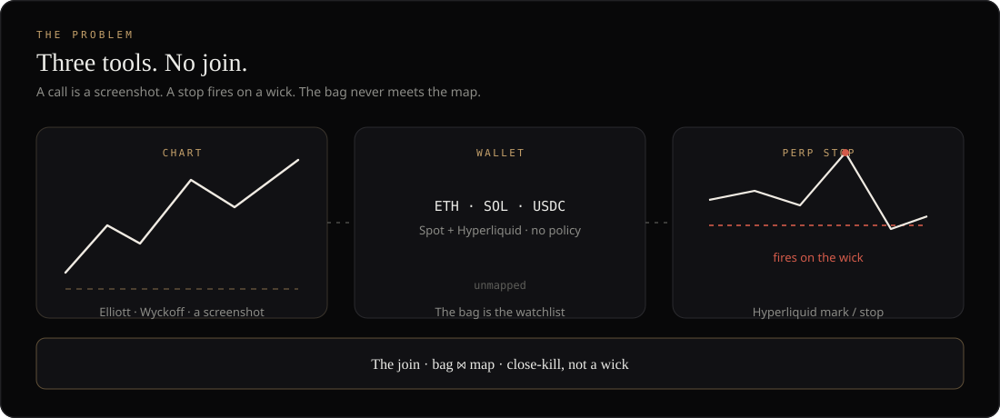
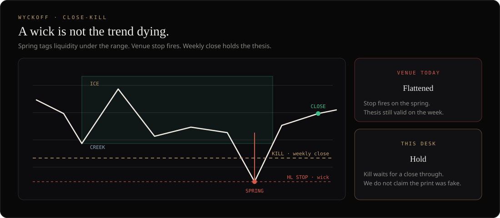
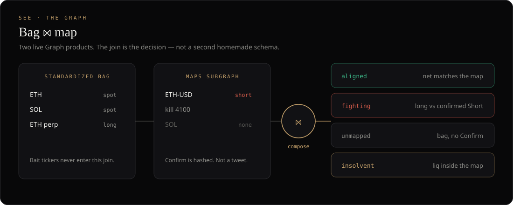
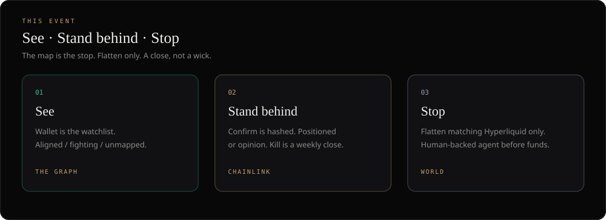

<p align="center">
  
</p>

# TradeCharts Attest
<p align="left">
  
</p>

ETHOnline 2026 Continuity. Live desk: [tradecharts.app](https://tradecharts.app)  
[Spec](docs/SPEC.md) · [Architecture](docs/ARCHITECTURE.md) · [Security](docs/SECURITY.md)

The open-source join between the chart, the wallet, and the stop. No shared git history with the commercial desk.

## The problem

The chart, the wallet, and the perp stop still live in three places. A call is a screenshot. A Hyperliquid stop fires on mark and **wicks**. Nothing answers: *is this book fighting its own map?*

Charts, venue stops, and wallet dashboards already exist. We do not claim they do not. What is missing is a map you can stand behind on **your** coins — and a kill that cannot be taken out by a print that was never a trend change.

### Why a wick is not “the trend died”

Wyckoff already named this. A **spring** (or an **upthrust**) is built to take stops: price tags liquidity beyond the range, then closes back inside. Composite operators hunt the obvious stop. The venue does exactly what they need — flatten on the wick — and the real trend continues.

We do **not** claim we can prove a print was spoofed, washed, or “artificial.” That is unprovable from a chart, and it is not this product.

We claim something narrower, and testable:

- Invalidation is a **weekly close** through the kill, not a five-minute wick.
- The bag sits next to the map: **aligned**, **fighting**, **unmapped**, or **insolvent** (liq inside a still-valid thesis).
- Flatten can only reduce. It cannot add size, open, or rotate.

Elliott is the structure. Wyckoff is the warning that a wick can be a hunt. The join is what makes that warning *act* on the book you actually hold.

### Who this is for

Wallet-native traders (Kai). Spot on Ethereum / Arbitrum / Base, perps on Hyperliquid. Thesis in their head or in Telegram. Not an equity guest, not a signals feed.

| What they have | What goes wrong today |
|---|---|
| Long ETH perp, weekly map still valid | A spring wicks through the HL stop. They are flat. The week closes back in range. Stopped by the hunt, not the thesis. |
| Confirmed Short on ETH, still holding ETH + a long | Three tools, no sentence that says **fighting**. They add size into their own kill. |
| Pendle YT, staked CHIP, dust ETH — no Confirm | The bag *is* the watchlist, but there is no policy. Unmapped. A CLAIM airdrop token would have been a fourth row; we drop bait before compose. |
| Liq sitting inside the weekly map | The position dies before the thesis does. That is **insolvent** — visible only if book and map share a pane. |

See / Stand behind / Stop is how we close those four.

<p align="center">
  
</p>
<p align="center">
  
</p>

## Architecture

<p align="center">
  
</p>

How the join works, what lives in this repo, and how the live desk consumes it without this tree including the commercial app: [docs/ARCHITECTURE.md](docs/ARCHITECTURE.md).

<p align="center">
  
</p>

## Live desk

<p align="center">
  
</p>

<p align="center">
  
</p>

Wallet SIWE. Binance coin-volume tape. Spot + Hyperliquid reads. Elliott / Wyckoff / Fib / internals / events / indicators. Validator is the render gate. Confirm is still private JSON. The book does not flatten.

## This event (Beta)

<p align="center">
  
</p>

| | Module | Partner |
| --- | --- | --- |
| **See** | `src/policy/conflict.ts` | **The Graph** — subgraph of maps + conflict. Live queries, not mocked. |
| **Stand behind** | `src/policy/hash.ts` | **Chainlink** Data Streams / CRE — weekly close that invalidates. |
| **Stop** | `src/policy/kill.ts` | **Ledger** — approve before flatten. Flatten only. |
| **Validator** | `src/validator/` | Same gate as production. Copied, tested. |

<p align="center">
  
</p>

<p align="center">
  
</p>

<p align="center">
  
</p>

## Methodology

<p align="center">
  
</p>

<p align="center">
  
</p>

<p align="center">
  
</p>

Visitor docs: https://tradecharts.app/docs

## Run

```bash
npm install
npm test
```

Copy `.env.example` to `.env` for a Graph gateway key. Never commit `.env`.

## Security

Hostile token metadata, flatten-only agents, and what must not land in git: [docs/SECURITY.md](docs/SECURITY.md). `npm test` covers compose dropping phishing tickers and `mayAgent` forbidding add-size.

## Out of scope

Private desk UI, store binaries, billing, copy-trading, Uniswap LP, Hedera pay-per-query.
