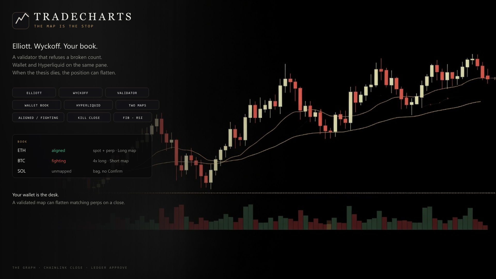
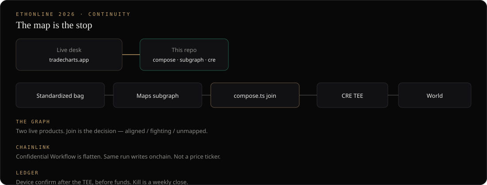
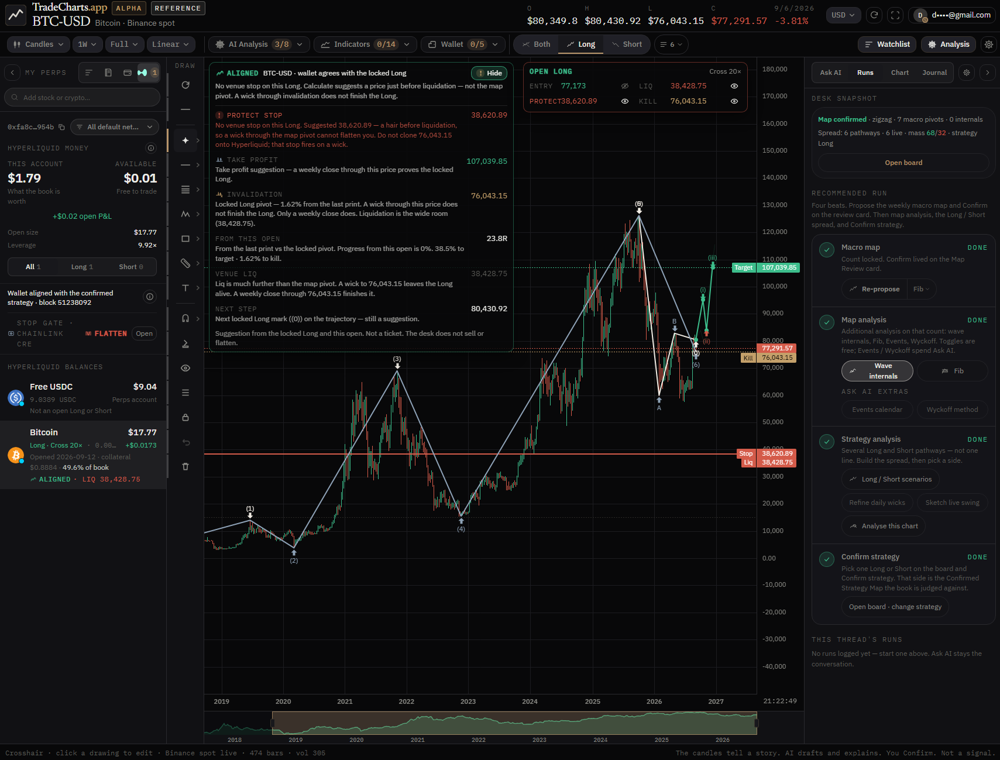
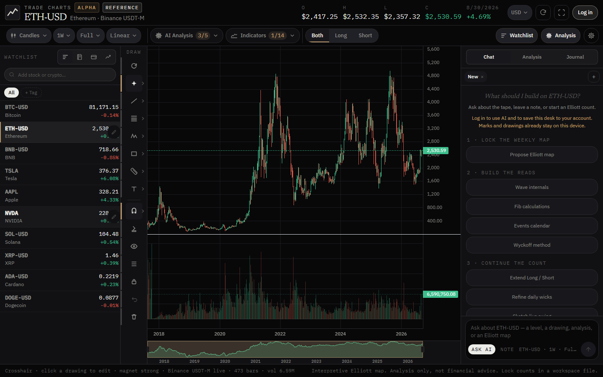
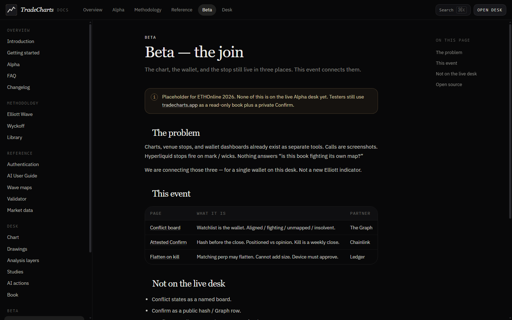
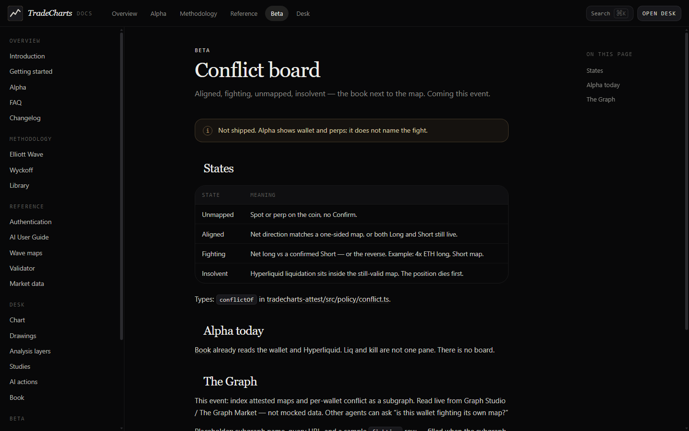
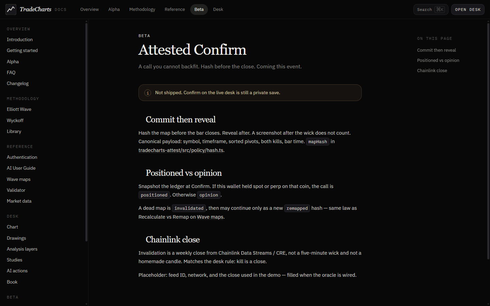
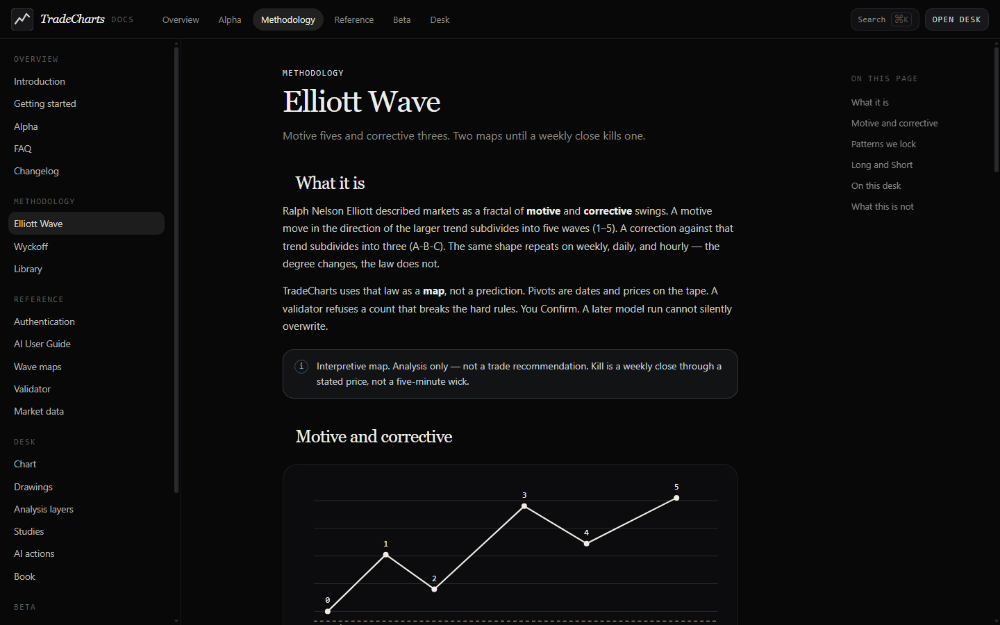
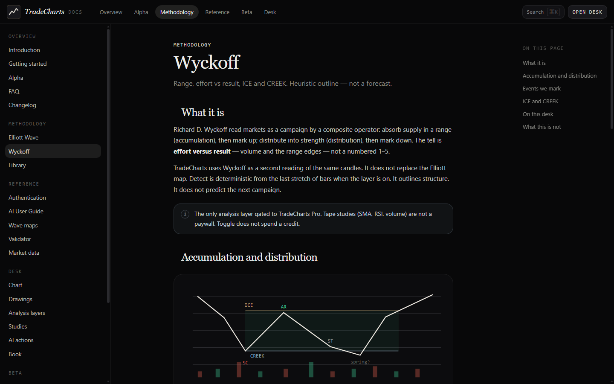
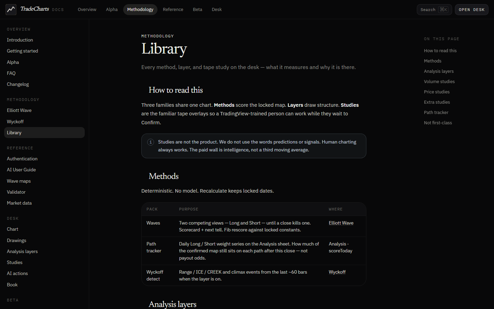

<p align="center">
  
</p>

<p align="center">
  
</p>

# TradeCharts Attest

The chart, the wallet, and the perp stop still live in three places. This repo is the open-source piece that connects them.

ETHOnline 2026 Continuity. Live desk (Alpha): https://tradecharts.app  
Spec: [docs/SPEC.md](docs/SPEC.md)

Charts, venue stops, and wallet dashboards already exist. We do not claim they do not. What is missing is the join: a validated map tied to **your** book, a public record of aligned / fighting / unmapped, a kill on a **weekly close**, and a flatten that cannot add size.

No shared git history with the commercial app.

## Architecture

<p align="center">
  
</p>

How the join works, what lives in this repo, and how the live desk consumes it without this tree including the commercial app: [docs/ARCHITECTURE.md](docs/ARCHITECTURE.md).

## Live desk

<p align="center">
  
</p>

<p align="center">
  
</p>

Wallet SIWE. Binance coin-volume tape. Spot + Hyperliquid reads. Elliott / Wyckoff / Fib / internals / events / indicators. Validator is the render gate. Confirm is still private JSON. The book does not flatten.

## This event (Beta)

<p align="center">
  
</p>

| | Module | Partner |
| --- | --- | --- |
| **See** | `src/policy/conflict.ts` | **The Graph** — subgraph of maps + conflict. Live queries, not mocked. |
| **Stand behind** | `src/policy/hash.ts` | **Chainlink** Data Streams / CRE — weekly close that invalidates. |
| **Stop** | `src/policy/kill.ts` | **Ledger** — approve before flatten. Flatten only. |
| **Validator** | `src/validator/` | Same gate as production. Copied, tested. |

<p align="center">
  
</p>

<p align="center">
  
</p>

## Methodology

<p align="center">
  
</p>

<p align="center">
  
</p>

<p align="center">
  
</p>

Visitor docs: https://tradecharts.app/docs

## Run

```bash
npm install
npm test
```

## Out of scope

Private desk UI, store binaries, billing, copy-trading, Uniswap LP, Hedera pay-per-query.
