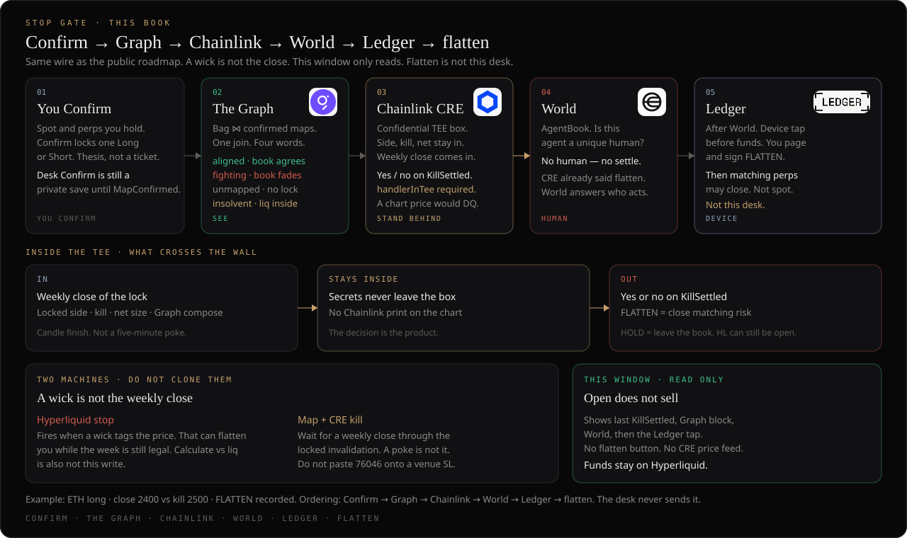
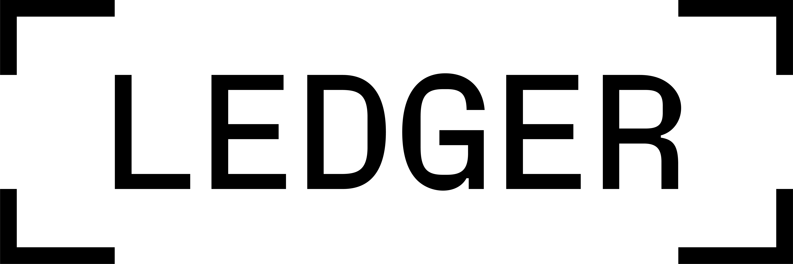
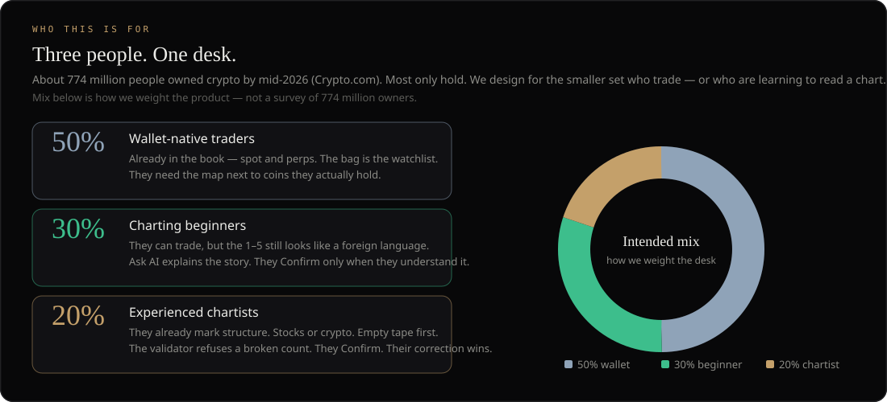
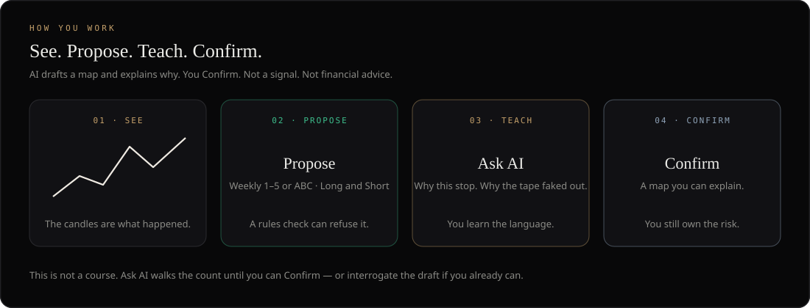
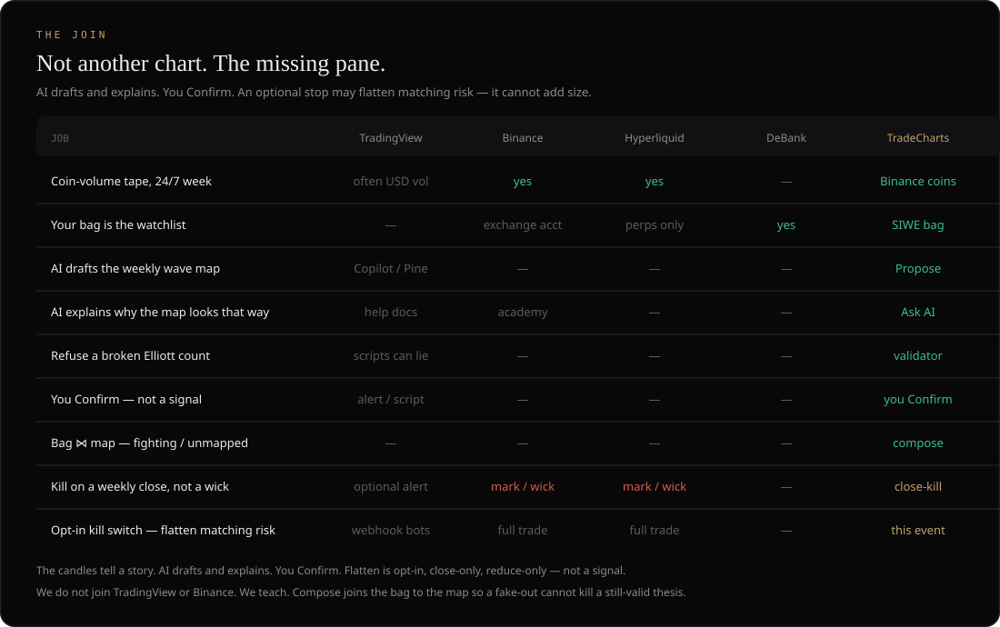

<p align="center">
  
</p>

# TradeCharts Attest

<p align="left">
  
</p>

ETHOnline 2026 Continuity. Judges clone **this** repo. Live desk: [tradecharts.app](https://tradecharts.app)

[Spec](docs/SPEC.md) · [Architecture](docs/ARCHITECTURE.md) · [Security](docs/SECURITY.md) · [Desk docs](https://tradecharts.app/docs) · [The Graph](docs/GRAPH.md)

The open-source join between the chart, the wallet, and the stop. No shared git history with the commercial desk.

Landing [tradecharts.ai](https://tradecharts.ai) is the story. The desk is `.app`. **Rules over vibes.** Interpretive map — not a signal, not advice.

> Confirm on the desk is still a **private save**. Flatten is **not** live on Hyperliquid. World AgentBook register still needs an **Orb**. Ledger is built as an unticked device fallback.

## Wire

**Confirm → Graph → Chainlink → World → Ledger → flatten.** Sequential. This repo proves the join. The desk only reads.

<p align="center">
  
</p>

| | Module | Partner |
| --- | --- | --- |
| **See** | `src/graph/compose.ts` · `src/policy/conflict.ts` | **The Graph** — two Studio products, joined. Live queries, not mocked. |
| **Stand behind** | `cre/` · `src/policy/kill.ts` | **Chainlink** CRE `handlerInTee` — weekly close. `KillSettled` on Base Sepolia. |
| **Stop** | `world/` then `ledger/` | **World** is who. **Ledger** is the flatten tap (built, not a form tick). |
| **Validator** | `src/validator/` | Same gate as production. Copied, tested. |

<p align="center">
  
</p>

## Live desk

<p align="center">
  
</p>

Wallet SIWE. Binance coin-volume tape. Spot + Hyperliquid reads. Validator is the render gate. Confirm is still private JSON. The book does not flatten.

Desk consume: [Conflict board](https://tradecharts.app/docs/conflict) · [Chainlink](https://tradecharts.app/docs/chainlink) · [World](https://tradecharts.app/docs/world) · [Ledger](https://tradecharts.app/docs/ledger)

## Run

```bash
npm install
npm test                  # 88 offline (compose, conflict, Ask payload, MCP)
LIVE_GRAPH=1 npm test     # + the live compose check against both Studio subgraphs
npm run compose -- 0x…    # bag ⋈ maps → conflict rows
```

**Browser demo** (paste any `0x`, no keys):

```bash
cd demo && npm install && npm run dev
```

**MCP** — same payload over stdio (`mcp/SKILL.md`). `source=base` is keyless. `aave` / `both` need `GRAPH_API_KEY` in that server’s env — never commit it.

```json
{
  "mcpServers": {
    "tradecharts-compose": {
      "command": "node",
      "args": ["mcp/server.mjs"],
      "cwd": "/absolute/path/to/tradecharts-attest"
    }
  }
}
```

**Partners** (each folder has its own install):

```bash
cd cre && bun install && bun test          # Chainlink CRE — see cre/README.md to simulate
node world/resolve.mjs 0x09759E44…         # World AgentBook — registered: false until Orb
node ledger/approve.cjs '{flatten:true,…}' # Ledger Speculos — HOLD never prompts
```

**Subgraphs** (Studio deploy key, never committed):

```bash
cd subgraphs/bag && npm install && npm run deploy     # trade-charts-bag — Base ERC-20 balances
cd subgraph      && npm install && npm run deploy:base # MapConfirmed on Base + seed ETH/BTC/VIRTUAL
cd subgraph      && npm run codegen && npm run deploy  # trade-charts — maps
```

`.env.example` is CRE simulate (+ optional `GRAPH_API_KEY` for Aave). Copy to `.env`. Never commit `.env`. Keyless Studio needs no file.

## The Graph

<p align="left">
  
</p>

Partner map: [tradecharts.app/docs/graph](https://tradecharts.app/docs/graph) · [docs/GRAPH.md](docs/GRAPH.md). Official mark: [thegraph.com/brand](https://thegraph.com/brand/).

<p align="center">
  
</p>
<p align="center">
  
</p>

**You ask. The wallet is the book. Ask AI cites a live Studio join — it does not invent fighting.**

1. **You** type a book question — “Is my bag fighting this map?” Propose and Analyse still draft the weekly map; Ask cites the book against maps already confirmed onchain.
2. **Ask AI** does not guess `aligned` or `fighting`. This turn it re-fetches the join and must speak the cite: symbol, status, map side, size, maps subgraph block.
3. **Wallet** is the book. On the desk: SIWE, then RPC coins + Hyperliquid perps. Here: `demo/` and `compose_wallet` take a `0x` and read the Graph bag.
4. **The Graph** is two Studio products, joined in `src/graph/compose.ts`: two HTTP queries, then `conflictOf`. No single GraphQL join. Four values only — `aligned` · `fighting` · `unmapped` · `insolvent` (`src/policy/conflict.ts`).
5. **Cite** is required, for example `ETH aligned · confirmed long · spot 0.003323 · Graph maps block N` (`src/graph/prompt.ts`).

If Studio fails, the payload says Studio failed. The model must not invent a status. If the desk has no wallet, Ask says connect first.

| Product | Studio (keyless) | Chain | Indexes |
|---|---|---|---|
| Maps `trade-charts` | `api.studio.thegraph.com/query/1758683/trade-charts/version/latest` | Base | `MapConfirmed` `0x78D7F79e50d2fd8cC065A01f15A6d21d0F6d3C7C` (Studio v0.4.0) |
| Bag `trade-charts-bag` | `api.studio.thegraph.com/query/1758683/trade-charts-bag/version/latest` | Base | Allowlisted ERC-20: ETH (WETH), USDC, cbBTC, DEGEN, VIRTUAL, DAI (Studio v0.2.1) |

Bag and maps are on **Base**. Do not Graph Network Publish.

Optional third product: Messari Aave V3 on the Network (`src/graph/aave.ts`). Needs `GRAPH_API_KEY`. Not required for the Ask loop.

`MapConfirmed.confirm` takes a wallet as an argument. Paste your own `0x` in `demo/` or the CLI. This repo does not ship a personal book as the sample.

| Surface | Bag | Maps |
|---|---|---|
| Live desk board + Ask | Wallet RPC coins + Hyperliquid perps | Studio maps, fetched this turn |
| `demo/` and `compose_wallet` | Studio bag (Base allowlist) | Studio maps, same `conflictOf` |

A wallet can show ETH on the desk and spot `0` on the Graph bag. That is expected. The bag only indexes the allowlist on Base. Desk Ask is **maps-live**. This repo’s demo is **bag-live**. Both use the same status function.

Not this setup: arbitrary GraphQL over the Network, Graph Network Publish of these products, onchain Confirm from the live desk, or flatten when a kill prints.

## Chainlink

<p align="left">
  
</p>

Stand behind. Flatten is a CRE Confidential Workflow (`cre/`, `handlerInTee`): map side / kill / net stay in TEE secrets. A wick never fires. The public output is `{ flatten, symbol, close, kill, side, net, reasonHash }`.

`KillSettled` on Base Sepolia: [`0xe9CA1F66…`](https://sepolia.basescan.org/address/0xe9CA1F6678EE6344e163f8F48CBDA12be2FA2167). First settlement tx [`0x6fc08432…`](https://sepolia.basescan.org/tx/0x6fc08432f522e46e19c38cc79e9c747c94bf5ca92a5fbb93ef9b49905dee1804). The write is keyed by the TEE output — not CRE consensus inside the workflow. Flatten is not live on Hyperliquid.

Partner page: [tradecharts.app/docs/chainlink](https://tradecharts.app/docs/chainlink). Run: `cd cre && bun test`. Simulate: [cre/README.md](cre/README.md).

## World

<p align="left">
  
</p>

Who. After CRE says flatten, the settlement agent must resolve in AgentBook before anyone may Sign ([world/](world/)). Sandbox App + [world/feedback.md](world/feedback.md) are filled. Production `agentkit-cli register` still needs an Orb-verified World ID — device-only World App is not enough.

Partner page: [tradecharts.app/docs/world](https://tradecharts.app/docs/world). Resolve: `node world/resolve.mjs 0x09759E44aF6CFC013586ae9a0ecdBC3D27734C7b`.

## Ledger

<p align="left">
  
</p>

The flatten tap. After World, the Nano must show `FLATTEN` and Sign. Built in `ledger/` as a device fallback (not a form tick) — real Ethereum firmware on the partner-sanctioned [Speculos](https://developers.ledger.com/docs/device-app/references/framework) emulator. HOLD never prompts.

Partner page: [tradecharts.app/docs/ledger](https://tradecharts.app/docs/ledger). Kit: [ledger/README.md](ledger/README.md).

## Architecture

<p align="center">
  
</p>

How the join works, what lives here, and how the live desk consumes it without this tree including the commercial app: [docs/ARCHITECTURE.md](docs/ARCHITECTURE.md).

<p align="center">
  
</p>

## The problem

The chart, the wallet, and the perp stop still live in three places. A call is a screenshot. A Hyperliquid stop fires on mark and **wicks**. Nothing answers: *is this book fighting its own map?*

Charts, venue stops, and wallet dashboards already exist. We do not claim they do not. What is missing is a map you can stand behind on **your** coins — and a kill that cannot be taken out by a print that was never a trend change.

Wyckoff already named the wick: a **spring** (or **upthrust**) is built to take stops. We do **not** claim we can prove a print was spoofed. We claim something narrower:

- Invalidation is a **weekly close** through the kill, not a five-minute wick.
- The bag sits next to the map: **aligned**, **fighting**, **unmapped**, or **insolvent**.
- Flatten can only reduce. It cannot add size, open, or rotate.

<p align="center">
  
</p>
<p align="center">
  
</p>

| What they have | What goes wrong today |
|---|---|
| Long ETH perp, weekly map still valid | A spring wicks through the HL stop. They are flat. The week closes back in range. |
| Confirmed Short on ETH, still holding ETH + a long | Three tools, no sentence that says **fighting**. |
| Wallet connected, coins on the book, no Confirm | **Unmapped.** No kill and no policy until they Confirm a map. |
| Liq sitting inside the weekly map | **Insolvent** — visible only if book and map share a pane. |

Phishing ERC-20s (visit / claim / airdrop copy) never reach compose.

## Who this is for

**Trade — or learn the chart.** Three people. One desk. We design for people who trade, or who are learning the chart, and who need a map on coins they actually hold.

How we weight the desk (not a survey): **wallet-native traders ~50%** · **charting beginners ~30%** · **experienced chartists ~20%**.

<p align="center">
  
</p>
<p align="center">
  
</p>

AI is a job on this desk, not a chatbot bolted on. **Propose** drafts a weekly map. A rules check can refuse it. **You Confirm.** Close-kill flatten is this event (Beta) — not unsupervised “AI trading,” and not a promise to save every position.

| Job | TradingView | Binance | Hyperliquid | DeBank | TradeCharts |
|---|---|---|---|---|---|
| Coin-volume tape, 24/7 week | often USD vol | yes | yes | — | Binance coins |
| Your bag is the watchlist | — | exchange acct | perps | yes | SIWE bag |
| AI drafts the weekly wave map | Copilot / Pine | — | — | — | Propose |
| AI explains why the map looks that way | help docs | academy | — | — | Ask AI |
| Refuse a count that breaks the rules | scripts can lie | — | — | — | rules check |
| You Confirm — not a signal | alert / script | — | — | — | you Confirm |
| Bag ⋈ map (fighting / unmapped) | — | — | — | — | compose |
| Kill on a **weekly close**, not a wick | optional alert | mark / wick | mark / wick | — | close-kill |
| Opt-in kill switch — flatten matching risk | webhook bots | full trade | full trade | — | this event |

<p align="center">
  
</p>

## This event

<p align="center">
  
</p>
<p align="center">
  
</p>
<p align="center">
  
</p>

## Methodology

<p align="center">
  
</p>
<p align="center">
  
</p>
<p align="center">
  
</p>

Visitor docs: https://tradecharts.app/docs

## Security

Hostile token metadata, flatten-only agents, and what must not land in git: [docs/SECURITY.md](docs/SECURITY.md). `npm test` covers compose dropping phishing tickers and `mayAgent` forbidding add-size.

## Out of scope

Private desk UI, store binaries, billing, copy-trading, Uniswap LP, Hedera pay-per-query.
