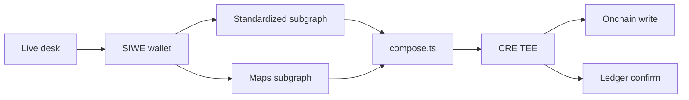

# Architecture

ETHOnline 2026 Continuity. This repo is the **open-source join**. The live desk is a separate product at [tradecharts.app](https://tradecharts.app). No shared git history.

**Problem:** chart, wallet, and perp stop live in three places. Venue stops fire on wicks (Wyckoff springs / upthrusts take those stops). Invalidation here is a weekly **close**; compose says whether the book is aligned, fighting, unmapped, or insolvent. We do not claim to detect spoofing. [README](../README.md#the-problem).

## This repo

| Path | Job |
|------|-----|
| `src/validator/` | Elliott gate (same rules as production) |
| `src/policy/` | `conflict` · `hash` · `kill` |
| `subgraph/` | Maps + conflict — The Graph Studio |
| `src/graph/standard.ts` | Standardized token/balance subgraph |
| `src/graph/compose.ts` | Join bag ⋈ maps → aligned / fighting / unmapped |
| `cre/` | Chainlink Confidential Workflow (`handlerInTee`) |
| `demo/` | Wallet in → live Graph rows. No desk required. |

## Existing product (not this tree)

Candles, SIWE, read-only book, Propose → validator → Confirm. Confirm is still private JSON. Flatten is not on the live desk until this module is wired.

## Partners

- **The Graph** — two live products joined; the decision uses that row.
- **Chainlink** — flatten is the CRE TEE; the same run writes onchain.
- **Ledger** — device confirm after the TEE, before funds.

Kill is a **close**, not a wick. Not a signal.

## Security

The join is the attack surface. Bag metadata is hostile; flatten cannot add size; maps come from Confirm. [docs/SECURITY.md](SECURITY.md).
