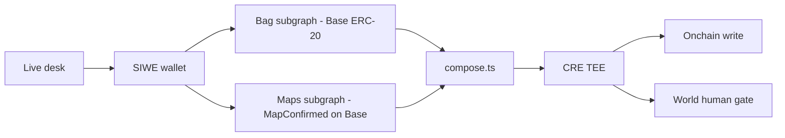

# Architecture

ETHOnline 2026 Continuity. This repo is the **open-source join**. The live desk is a separate product at [tradecharts.app](https://tradecharts.app). No shared git history.

**Problem:** chart, wallet, and perp stop live in three places. Venue stops fire on wicks (Wyckoff springs / upthrusts take those stops). Invalidation here is a weekly **close**; compose says whether the book is aligned, fighting, unmapped, or insolvent. We do not claim to detect spoofing. [README](../README.md#the-problem). Segment vs TradingView / Binance / Hyperliquid / DeBank: [README](../README.md#where-this-sits).

Partner Graph setup (Ask loop, two products, honesty): [GRAPH.md](GRAPH.md).

## This repo

| Path | Job |
|------|-----|
| `src/validator/` | Elliott gate (same rules as production) |
| `src/policy/` | `conflict` · `hash` · `kill` |
| `subgraph/` | Maps subgraph — `MapConfirmed` on Base `0x78D7F79e50d2fd8cC065A01f15A6d21d0F6d3C7C`. Live Studio v0.4.0. |
| `subgraph/contracts/` | `MapConfirmed.sol` — live on **Base** `0x78D7F79e…`. Same ABI as the earlier Sepolia seed (fallback only). |
| `subgraphs/bag/` | Bag subgraph — Base ERC-20 balances (allowlisted tokens), Transfer events in a ≈2-week window at head. **Live on Studio.** |
| `src/graph/standard.ts` | Bag client — Studio endpoint (keyless) or Network gateway mode |
| `src/graph/compose.ts` | Join bag ⋈ maps → aligned / fighting / unmapped / insolvent |
| `src/graph/prompt.ts` | Ask / MCP cite payload (`composeAskPayload`) |
| `src/graph/live.test.ts` | `LIVE_GRAPH=1 npm test` — the live two-subgraph join |
| `src/graph/wallet.ts` | `compose_wallet` — same Ask payload, keyless `base` path |
| `mcp/` | stdio MCP + `SKILL.md`. One tool. No desk keys. |
| `demo/` | Paste an address → live compose rows. No keys, no desk. **Shipped.** |
| `cre/` | Close-kill CRE Confidential Workflow (`handlerInTee`): private kill policy in secrets, deterministic decision, `KillSettled` onchain write. **Shipped; live CRE run after the Chainlink session.** |
| `ledger/` | The human gate after the TEE, before funds — Agent Stack / Key Ring plan + DQ notes. |

## Existing product (not this tree)

Candles, SIWE, read-only book, Propose → validator → Confirm. Confirm is still private JSON. Flatten is not on the live desk until this module is wired.

## Partners

- **The Graph** — two live Studio products (maps v0.4.0, bag v0.2.1) joined in `compose.ts`; the decision uses that row.
- **Chainlink** — flatten is the CRE TEE (`handlerInTee`); `KillSettled` records it. Write is keyed by TEE output.
- **World** — the agent must resolve to a verified human in AgentBook after the TEE, before funds. Register still needs Orb. Ledger is the device fallback.

Kill is a **close**, not a wick. Not a signal.

## Security

The join is the attack surface. Bag metadata is hostile; flatten cannot add size; maps come from `MapConfirmed` events. [docs/SECURITY.md](SECURITY.md).

Desk Ask is **maps-live** (RPC coins + Hyperliquid ⋈ Studio maps). `demo/` and `compose_wallet` are **bag-live** (Studio bag ⋈ the same maps). The mermaid above is the Graph products; the desk board does not query the bag subgraph.
