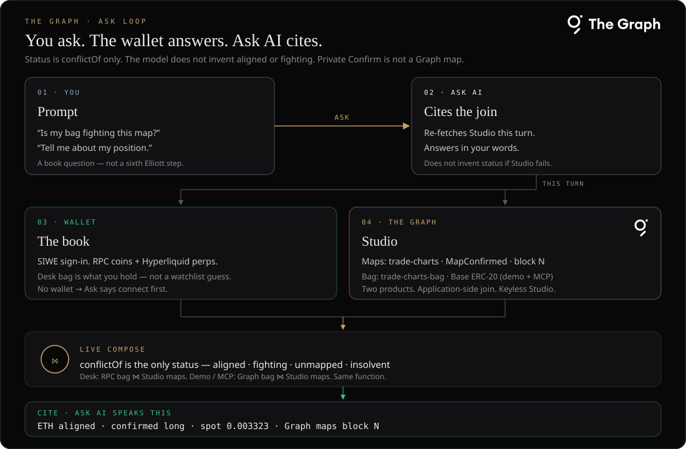
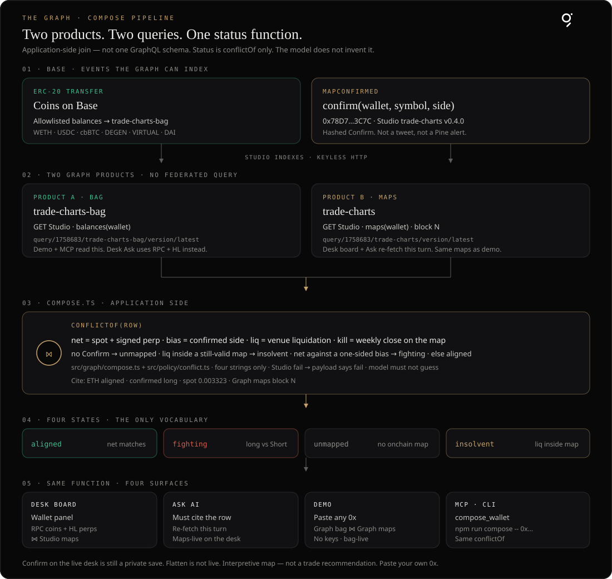

# The Graph

<p align="left">
  
</p>

Partner read. Same map as the desk page [tradecharts.app/docs/graph](https://tradecharts.app/docs/graph). Official mark: [thegraph.com/brand](https://thegraph.com/brand/).

**You ask. The wallet is the book. Ask AI cites a live Studio join — it does not invent fighting.**

Bag and maps are on **Base** — one chain for the demo. Live Studio maps (`trade-charts` v0.4.0) index `MapConfirmed` `0x78D7F79e50d2fd8cC065A01f15A6d21d0F6d3C7C`. Confirm on the live desk is still a private save. Flatten is not live. Interpretive map — not a trade recommendation.



## The problem

People already have a chart, a wallet, and a chat box. None of those three will answer: **are the coins I hold fighting the count I said I believe?**

That is not a missing indicator. It is a missing join. The count lives as a drawing or a screenshot. The coins live at a venue or a portfolio app. The model in the chat will invent “aligned.” Nothing in the middle is a live, queryable decision — four words only, the same function every time.

| Pain | What others do | What this does — and why there is no stand-in |
|---|---|---|
| You are long the coin while your own weekly count is Short. | TradingView never sees the wallet. DeBank / Zapper never see a Confirm. The venue only sees size. | Compose reads coins and confirmed maps, then `conflictOf` says fighting. No other product owns both sides. |
| You ask a model if the book is safe. It sounds sure. | ChatGPT, copilots, and venue chat guess. They do not re-fetch a subgraph this turn. | Ask AI must cite the row — symbol, status, map side, size, maps block — or say Studio failed. It may not invent fighting. |
| Last month’s “call” is a screenshot. Nobody can query it. | Twitter, Discord, and TradingView ideas are pictures. Subgraph browsers show raw entities, not a decision. | `MapConfirmed` is an onchain event Studio indexes. Partners run the same join in `demo/`, MCP, or `npm run compose` — `0x` in, rows out. |
| A portfolio lists every airdrop as if it were the book. | Wallet dashboards optimize for “what tokens exist.” They do not know a hashed count. | The desk book is the connected wallet (RPC + Hyperliquid). The Graph bag is an allowlist on Base. Hostile metadata never enters compose. |
| A fake spike takes the obvious stop. | Binance and Hyperliquid flatten on mark / wick. The chart app can alert. Neither knows your map. | Invalidation here is a weekly close on a confirmed map. Flatten is not live yet — the board still names insolvent when liquidation sits inside that map. |

Adjacent tools each own one pane. A chart company is not a wallet indexer; a portfolio is not an Elliott Confirm; a venue is not a map; a generic model has no duty to cite The Graph. The join is the product.

## How it connects

1. **You** type a book question — “Is my bag fighting this map?” or “Tell me about my position.” That is not a sixth Elliott step.
2. **Ask AI** does not guess aligned or fighting. This turn it re-fetches the join.
3. **Wallet** is the book: SIWE on the desk (RPC coins + Hyperliquid perps). In this repo, `demo/` and `compose_wallet` take a `0x` and read the Graph bag.
4. **The Graph** is two Studio products. Compose is application-side (`src/graph/compose.ts`): two HTTP queries, then `conflictOf`. There is no single GraphQL join.
5. **Cite** is the sentence Ask must speak: `ETH aligned · confirmed long · spot 0.003323 · Graph maps block N`.

Status has four values only: `aligned` · `fighting` · `unmapped` · `insolvent`. Policy: [`src/policy/conflict.ts`](../src/policy/conflict.ts). Formatter: [`src/graph/prompt.ts`](../src/graph/prompt.ts) (`composeAskPayload`, `citeComposeRow`).

If Studio fails, the payload says Studio failed. The model must not invent a status. If the desk has no wallet, Ask says connect first.

## How compose runs

Two live Graph products. Two HTTP queries. Then TypeScript — `conflictOf` — not a federated GraphQL join.




## Two products

| Product | Studio (keyless) | Chain | What it indexes |
|---|---|---|---|
| Maps `trade-charts` | `https://api.studio.thegraph.com/query/1758683/trade-charts/version/latest` | Base | `MapConfirmed` `0x78D7F79e50d2fd8cC065A01f15A6d21d0F6d3C7C` (Studio v0.4.0) |
| Bag `trade-charts-bag` | `https://api.studio.thegraph.com/query/1758683/trade-charts-bag/version/latest` | Base | Allowlist: WETH, USDC, cbBTC, DEGEN, VIRTUAL, DAI |

The maps contract and seed script live in this repo: [`subgraph/contracts/MapConfirmed.sol`](../subgraph/contracts/MapConfirmed.sol) · [`subgraph/scripts/deploy-base.mjs`](../subgraph/scripts/deploy-base.mjs). `confirm(wallet, …)` takes the book address as an argument. Do not Graph Network Publish.

Optional third Graph product for the composable line: Messari Aave V3 on the Network (`src/graph/aave.ts`). Needs `GRAPH_API_KEY`. Not required for the Ask loop.

Paste your own `0x` — this write-up does not ship a personal book as the sample. Basescan: [contract](https://basescan.org/address/0x78D7F79e50d2fd8cC065A01f15A6d21d0F6d3C7C).

## What each surface reads

| Surface | Bag | Maps |
|---|---|---|
| Live desk board + Ask | Wallet RPC coins + Hyperliquid perps | Studio maps, fetched this turn |
| `demo/` and `compose_wallet` | Studio bag (Base allowlist) | Studio maps, same `conflictOf` |

A wallet can show ETH on the desk and spot 0 on the Graph bag. That is expected — the bag subgraph only indexes the allowlist on Base. Desk Ask is **maps-live**. This repo’s demo is **bag-live**. Both use the same status function. `demo/` is bag ⋈ maps on Base.

## Capability

**Partners can run**

- Desk: wallet-panel compose + Ask AI cite on a book question — [tradecharts.app/docs/graph](https://tradecharts.app/docs/graph)
- `demo/` — paste any `0x`, no keys
- `npm run compose -- 0x…`
- `compose_wallet` MCP (`mcp/SKILL.md`) — `source=base` is keyless

**Not this setup**

- Arbitrary GraphQL over every subgraph on the Network
- Graph Network Publish of these products
- Onchain Confirm from the live desk
- Flatten when a kill prints

## Run

```bash
npm install
npm test
LIVE_GRAPH=1 npm test
npm run compose -- 0x…
cd demo && npm install && npm run dev
```

Live maps are already on Base (`subgraph/deployments/base.json`). To redeploy:

```bash
cd subgraph && npm install && npm run deploy:base
cd subgraph && npm run codegen && npm run deploy   # Studio label in package.json
```

Deploy keys stay out of git. Copy `.env.example` → `.env` only on your machine. See [README](../README.md#the-graph) and [SPEC](SPEC.md).
